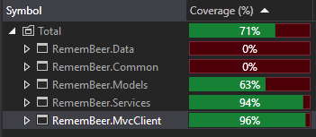
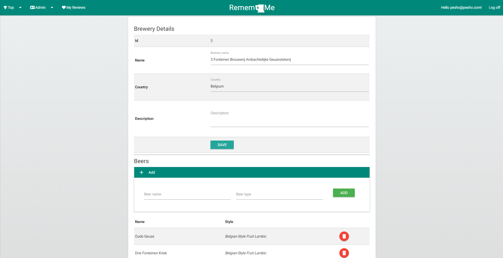



So, you are in <em>&lt;insert foreign country with great beers&gt;</em> having an ice-cold pint of <em>&lt;insert beer with a complicated name&gt;</em>. You really like it. 
           You would like to try it again on your next visit.

The sad part is you would never remember it for so long...

       

### Until now.

### Project startup
 * Install NuGet dependencies
 * Create a RememBeerMeSettings.config file in the src/RememBeer.WebClient folder
    - The file must have the following structure: 
    
            <appSettings>   
                <add key="UserNamesAllowOnlyAlphanumeric" value="true" />
                <add key="RequireUniqueEmail" value="true" />
                <add key="PasswordMinLength" value="6" />
                <add key="PasswordRequireNonLetterOrDigit" value="false" />
                <add key="PasswordRequireDigit" value="false" />
                <add key="PasswordRequireLowercase" value="false" />
                <add key="PasswordRequireUppercase" value="false" />
                <add key="UserLockoutEnabledByDefault" value="true" />
                <add key="DefaultAccountLockoutTimeSpan" value="5" />
                <add key="MaxFailedAccessAttemptsBeforeLockout" value="5" />

                <!-- Cloudinary -->
                <add key="ImageUploadName" value="" />
                <add key="ImageUploadApiKey" value="" />
                <add key="ImageUploadApiSecret" value="" />

                <!-- MailJet -->
                <add key="MailSenderEmailAddress" value="" />
                <add key="MailUsername" value="" />
                <add key="MailPassword" value="" />
            </appSettings>
            
* Start the application.
* Optionally run RemembeerMeDbSeed.sql to import brewery and beer data.

### Temporarily hosted on:
- [My ASP](http://j0hnybg-001-site1.dtempurl.com/)
 
### Youtube demo:
 - [Youtube](https://youtu.be/RHeR_bxmJQQ)
 
### Public Section
 
 Anyone can view a specific beer review when they have the link. All top beers and brewery rankings are publicly visible.
 
### Private Section
 

  Users can subscribe to their friends to recieve new review notifications and messages.
 They can also create and edit their own beer reviews and send messages to their followers.
 
### Administrative Section
 
   * User Management
   
     Website administrators can lock user accounts, change their permissions, manage their basic information and their posted reviews.
     
   * Brewery/beer management
   
     Administrators can change brewery information, add new beers to a brewery and delete old ones if needed.
     
### Unit Test Coverage

    
### Screenshots

